# 计算机组成原理（+嵌入式系统）

嵌入式要点：

* 嵌入式系统概述 ⭐️
* 嵌入式系统设计 ⭐️
  * 交叉开发环境
* 嵌入式硬件 ⭐️⭐️
  * 嵌入式微处理器分类
  * 嵌入式微处理器体系结构
  * Al芯片
  * 总线
* 嵌入式操作系统 ⭐️⭐️⭐️
  * 嵌入式实时操作系统
  * 操作系统内核架构
* 嵌入式数据库 ⭐️

> 仅提供综合选择部分内容，不建议选做嵌入式案例分析题

## 1 计算机结构

### 1.1 计算机系统组成

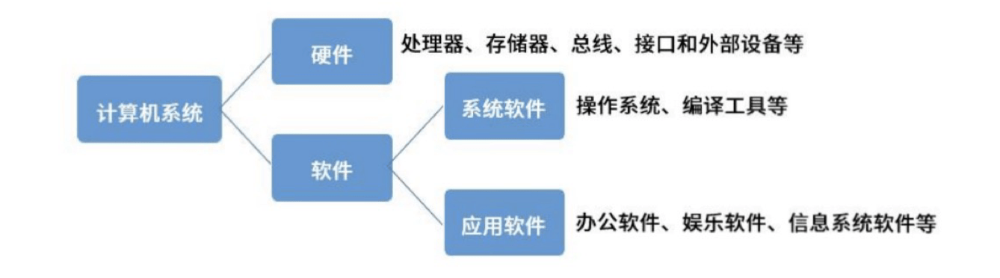

冯·诺依曼结构：

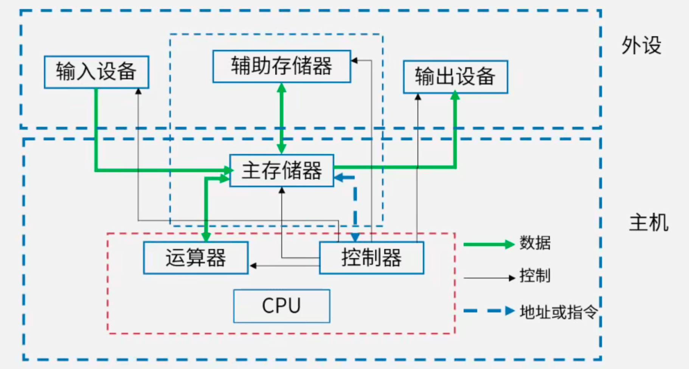

### 1.2 CPU

CPU组成：

* 运算器：
  1. 算术逻辑单元（ALU）：数据的算术运算与逻辑运算
  2. 累加寄存器（AC）：通用寄存器， 为ALU提供工作区，用于暂存数据
  3. 数据缓冲寄存器（DR）：写内存时，暂存指令或数据
  4. 状态条件寄存器（PSW）：存状态标志与控制标志 (争议：亦有将其归为控制器)
* 控制器：
  1. 程序计数器（PC）：存储下一条要执行指令的地址
  2. 指令寄存器（IR）：存储即将执行的指令
  3. 指令译码器（ID）：对指令中的操作码字段进行分析解释
  4. 时序部件：提供时序控制信号

计算机执行程序时，在一个指令周期的过程中，为了能够从内存中读指令操作码，首先将**程序计数器**（PC）的内容送到**地址总线**上。

### 1.3 总线

**总线**（Bus）是一组能为多个部件**分时共享**的信息传送线，用来连接多个部件并为之提供信息交换通路。总线通常是【**半双工**】的。

> 单工：一条线路只能进行单一的发送或接收
> 双工：一条线路既能进行发送，又能进行接收
> 半双工：一条线路在某一时刻**只允许一个设备进行发送**（即在两个方向上**轮流**传输信息），多个设备进行接收

特点：

* 挂接在总线上的多个部件只能分时向总线发送数据，但可同时从总线接收数据。
* 通过总线复用方式可以减少总线中信号线的数量，以较少的信号线传输更多的信息。

分类：

* 从功能上划分：**数据总线**、**地址总线**、**控制总线**（3总线结构）
* 从数据传输的方式划分：
  * **并行总线**：将数据字节的各位用**多条数据线**同时进行传送【**短距离**】
  * **串行总线**：数据一位一位地进行传输，在传输中每一位数据都占据一个固定的时间长度【**长距离**，传输波特率**可调整**，正确性依赖于**校验码**，数据传输方式可以使用多种】

### 1.4 计算机体系结构

体系结构分类：

1. **冯·诺依曼结构**（普林斯顿结构）：一种将程序指令存储器和数据存储器合并在一起的存储器结构。
   * 特点：
     * 指令与数据存储器合并在一起。
     * 指令与数据都通过相同的数据总线传输。
   * 典型应用：一般用于PC处理器，如I3、I5、I7处理器。
     * 注：常规计算机均属于冯·诺依曼结构
2. **哈佛结构**：一种并行体系结构，主要特点是将程序和数据存储在不同的存储空间中，即**程序存储器**和**数据存储器**是两个独立的存储器，每个存储器独立编址、独立访问。
   * 特点：
     * 指令与数据分开存储，可以**并行读取**，有较高数据的吞吐率。
     * 有4条总线：指令和数据的**数据总线**与**地址总线**。
   * 典型应用：一般用于嵌入式系统处理器。
     * 注：DSP属于哈佛结构

### 1.5 CISC与RISC

**复杂指令集计算机**（Complex Instruction Set Computers，**CISC**）与**精简指令集计算机**（Reduced Instruction Set Computers，**RISC**）两种指令系统的区别如下：


| 指令系统类型 | 指令                                                                                   | 寻址方式   | 实现方式                                             | 其他                       |
| ------------ | -------------------------------------------------------------------------------------- | ---------- | ---------------------------------------------------- | -------------------------- |
| CISC         | 数量多，使用频率差别大，可变长格式                                                     | 支持多种   | 微程序控制技术（微码）                               | 研制周期长                 |
| RISC         | 数量少，使用频率接近，定长格式，大部分为单周期指令，操作寄存器，只有Load/Store操作内存 | 支持方式少 | 增加了通用寄存器；硬布线逻辑控制为主；适合采用流水线 | 优化编译，有效支持高级语言 |

x86属于CISC，ARM属于RISC。

---

## 2 层次化存储体系

层次化/分级存储体系的主要目的：解决存储的容量、价格和速度之间的矛盾

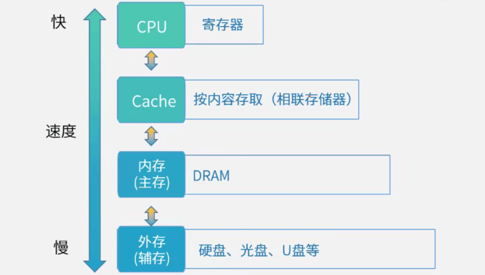

> 补充——数据传输的方式：
>
> * CPU访问内存通常是同步方式，I/O接口与CPU交换信息通常是同步方式，CPU与PCI总线交换信息通常是同步方式，I/O接口与打印机交换信息则通常采用基于**缓存池**的**异步**方式。

### 2.1 Cache

**Cache**（高速缓存）的功能：提高CPU数据输入输出的速率，突破冯·诺依曼瓶颈，即CPU与存储系统间数据传送带宽限制。

设计思想：在**合理的成本**下**提高命中率**

特点：

* 在计算机的存储系统体系中，Cache是**访问速度最快的层次**。
* Cache**对程序员来说是透明的**。（不直接操作）
* 使用Cache改善系统性能的依据是程序的**局部性原理**。
  * **时间局部性**：指程序中的某条指令一旦执行，不久以后该指令可能再次执行，典型原因是由于程序中存在着大量的循环操作。
  * **空间局部性**：指一旦程序访问了某个存储单元，不久以后，其附近的存储单元也将被访问，即程序在一段时间内所访问的地址可能集中在一定的范围内，其典型情况是程序顺序执行。
  * **工作集理论**：工作集是进程运行时被频繁访问的页面集合。

设`h`为对Cache的**访问命中率**，`t1`表示Cache的周期时间，`t2`表示主存储器周期时间，以读操作为例，使用“Cache+主存储器”的系统的平均周期为`t3`，则：`t3 = h × t1 + (1 - h) × t2`。其中，`(1 - h)`又称为**失效率**（未命中率）。

### 2.2 主存编址

* 存储单元：`存储单元个数 = 最大地址 - 最小地址 + 1`
* 编址内容：`总容量 = 存储单元个数 × 编址内容`
  * 按**字**编址：存储体的存储单元是字存储单元，即最小寻址单位为**1个字**（32位系统：`4B`；64位系统：`8B`）
  * 按**字节**编址：存储体的存储单元是字节存储单元，即最小寻址单位为**1个字节**（`1B = 8bit`）
* 芯片总数：`总片数 = 总容量 / 每片的容量`
  * 根据存储器所要求的容量和选定的存储芯片的容量，即可计算出所需芯片的总数

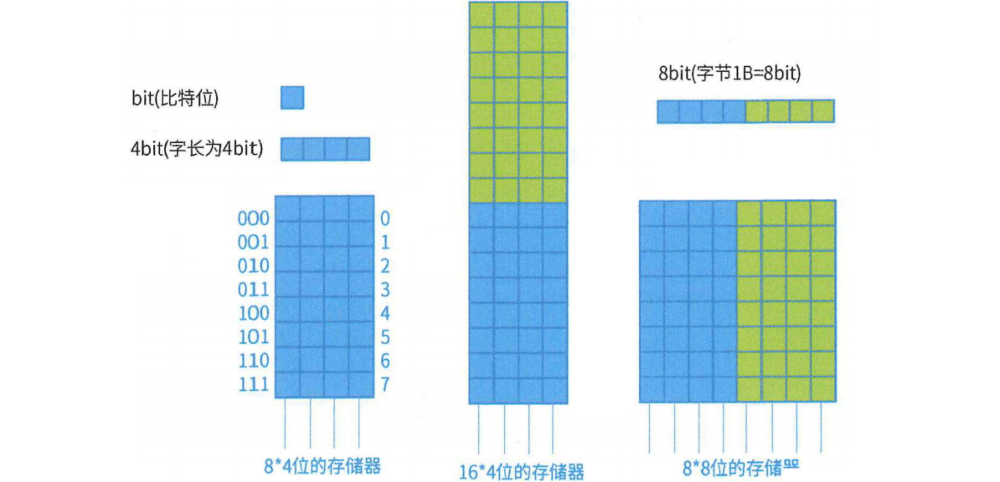

### 2.3 磁盘管理

**磁盘**的结构：

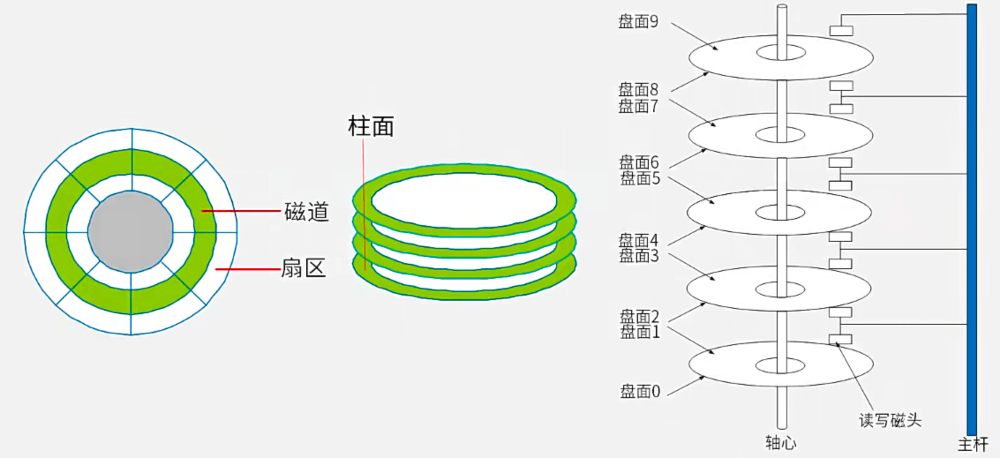

#### 2.3.1 数据读取时间

**存取时间**（Access Time）计算式：`存取时间 = 寻道时间 + 等待时间`

* **寻道时间**：磁头移动到磁道所需的时间
* **等待时间**：等待读写的扇区转到磁头下⽅所⽤的时间

> 注：（平均）**存取时间不考虑读取**。

读取磁盘数据的时间包括以下三个部分：

1. 找磁道的时间（**寻道时间**）
2. 找块/扇区的时间（**旋转延迟时间**）
3. **传输时间**

#### 2.3.2 磁盘调度算法

磁盘**移臂调度**算法：

1. **先来先服务**（First-Come First Served，**FCFS**）：谁先申请先服务谁
2. **最短寻道时间优先**（Shortest Seek Time First，**SSTF**）：申请时判断与磁头当前位置的距离，**谁近先服务谁**
3. **扫描算法**（SCAN）：电梯算法，**双向**扫描
4. **循环扫描**（CSCAN）：**单向**扫描

**先来先服务**（First-Come First Served，**FCFS**）算法中，访问序号即为**申请序号**：

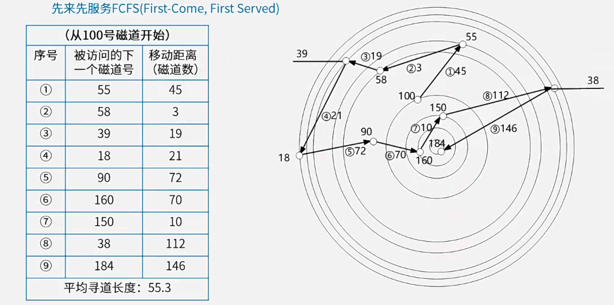

**最短寻道时间优先**（Shortest Seek Time First，**SSTF**）算法中，被访问的下一个磁道为**距离<u>当前磁道</u>最近**（相关参数：柱面号、磁道号）的待访问磁道：


> 有时请求序列中各数据位于不同柱面/磁道/扇区，此时磁头移动呈抛物线。为了方便，常**无视扇区条件**，即满足位于同一柱面、距离最小的所有目标均为合法的下一目标。

#### 2.3.3 磁盘优化分布存储

【例】假设某磁盘的每个磁道划分为11个物理块，每块存放1个逻辑记录。逻辑记录`R[0]`、`R[1]`、……、`R[9]`、`R[10]`存放在同一个磁道上，记录的存放顺序如下表所示：

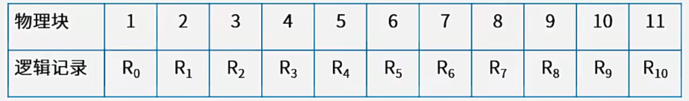

如果磁盘的**旋转周期**（旋转一周的时间）为33ms，磁头当前处在`R[0]`的开始处。若系统使用<u>单缓冲区</u>顺序处理这些记录，每个**记录处理时间**为3ms，则处理这11个记录的最长时间为（?）；若对信息存储进行优化分布后，处理11个记录的最少时间为（?）。
A. 33ms；B. 336ms；C. 366ms；D. 376ms
A. 33ms；B. 66ms；C. 86ms；D. 93ms

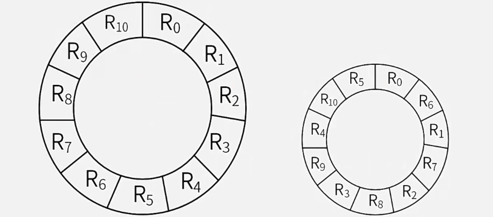

【解】上图分别为未优化（左）和优化后（右）的记录分布：

* 第1问：由旋转周期得，磁头每经过一个物理块耗时`33ms / 11 = 3ms`，正好等于记录处理时间。故每当某记录`R[i]`处理结束后要处理下一记录`R[i + 1]`时，磁头早已滑动至`R[i + 1]`的结束处，使得需让磁盘继续转至`R[i + 1]`头部才可开始操作，即产生了**旋转延迟时间**，为`3ms * 10 = 30ms`。由此可得未优化时的最长处理时间为`3ms + 3ms + (30ms + 3ms + 3ms) * 10 = 366ms`。答案为C。
* 第2问：优化后的记录存放顺序为`R[0], R[6], R[1], R[7], R[2], R[8], R[3], R[9], R[4], R[10], R[5]`（分别位于物理块1~11，循环），不会产生旋转延迟时间，对每个记录的处理时间均为`3ms + 3ms = 6ms`，故优化后的最少处理时间为`6ms * 11 = 66ms`。答案为B。

#### 2.3.4 磁盘单缓冲区与双缓冲区读取

【例】假设磁盘块与缓冲区大小相同，每个盘块读入缓冲区的时间为15μs，由缓冲区送至用户区的时间是5μs，在用户区内系统对每块数据的处理时间为1μs，若用户需要将大小为10个磁盘块的Doc1文件逐块从磁盘读入缓冲区，并送至用户区进行处理，那么采用单缓冲区需要花费的时间为（?）μs；采用双缓冲区需要花费的时间为（?）μs。
A. 150；B. 151；C. 156；D. 201
A. 150；B. 151；C. 156；D. 201

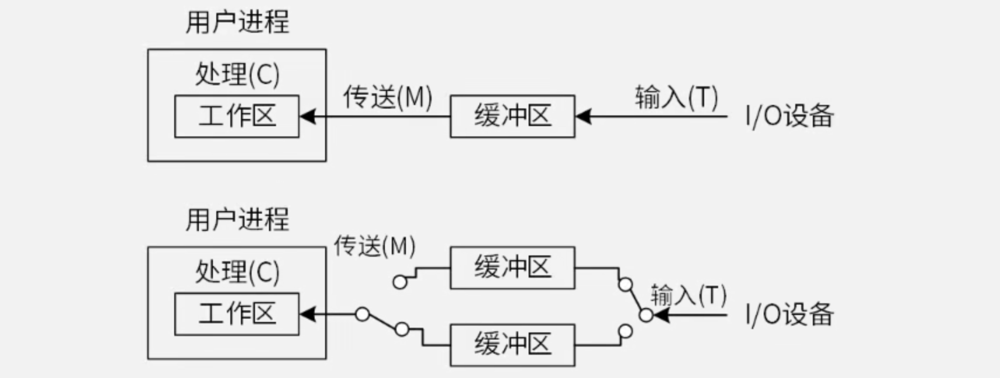

【解】上图分别为单缓冲区（上）和双缓冲区（下）的磁盘读取过程：

* 第1问：数据块1自身花费`15μs + 5μs + 1μs`，数据块2在数据块1开始被用户工作区处理时（即“`1μs`”部分）开始读取缓冲区（即开始重复数据块1的流程），后续块同理。可见，“`1μs`”部分仅在最后一个块时被单独计算（此前均与其他读入操作并行），因此采用单缓冲区的总花费时间为`(15μs + 5μs) * 10 + 1μs = 201μs`。答案为D。
  * 可根据[流水线执行时间](https://www.hyperplasma.top/article/5173/##161 "流水线执行时间")公式进行计算，存在3个处理步骤：①读入缓冲区（`15μs`）、②送出缓冲区（`5μs`）、③用户工作区处理（`1μs`）。由于步骤①和②**都需访问临界资源**（缓冲区），故需合并成1个操作阶段。流水线周期为`15μs + 5μs = 20μs`，故可得：`(20 + 1) + (10 - 1) * 20 = 201(μs)`
* 第2问：数据块1读入缓冲区1（上）后，在送出缓冲区的同时（即“`5μs`”部分）数据块2读入缓冲区2（下），后续块同理。可见，此时`5μs + 1μs`部分仅在最后一个块时被单独计算（此前均与读入另一个缓冲区的操作**并行**），因此采用双缓冲区的总花费时间为`15μs * 10 + 5μs + 1μs = 156μs`。答案为C。
  * 与单缓冲区同理，可根据流水线执行时间公式进行计算。注意此时步骤①和②每次均为交替对不同的缓冲区进行访问，故无需合并。流水线周期为`15μs`，故可得：`(15 + 5 + 1) + (10 - 1) * 15 = 156(μs)`

以下分别为单缓冲区和双缓冲区的流水线时空图表示：

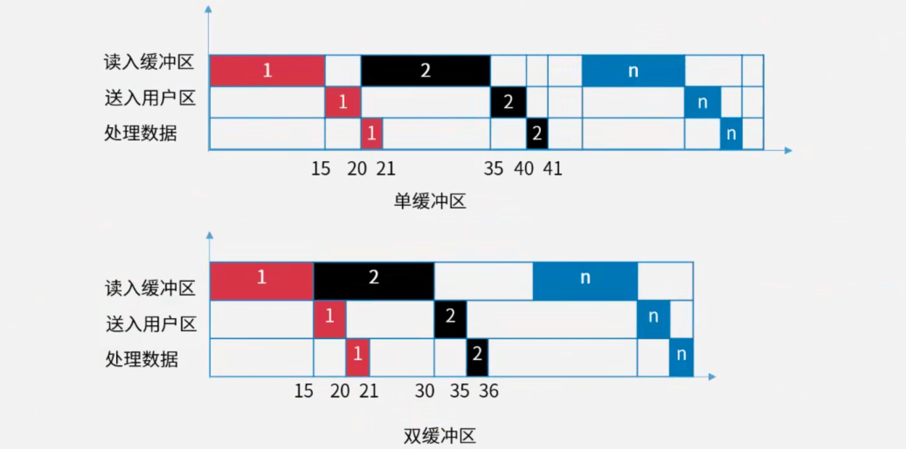

### 2.4 I/O控制

详见[操作系统](https://www.hyperplasma.top/article/5173/ "操作系统")

---

## 3 校验码

### 3.1 奇偶校验

**奇偶校验码**的编码方法：由若干位有效信息（如一个字节）加上1个二进制位（校验位）组成校验码。

分为两种校验方式：

* **奇校验**：整个校验码（有效信息位和校验位）中`1`的个数为奇数。
* **偶校验**：整个校验码（有效信息位和校验位）中`1`的个数为偶数。

特点：奇偶校验只可检查**奇数位**错误，**不可纠错**。

【例】设用户信息中“男”“女”分别用`0`、`1`表示。使用偶校验，则传输“女”的信息`1`并添加校验位可得校验码为`11`（“男”同理，为`00`，后略）。当产生1（奇数）位错误时有`01`、`10`两种情况，此时`1`的个数非偶数，可以检查出存在错误，但无法纠错。当产生2位错误时为`00`，满足了偶校验定义，此时无法检查出错误。

### 3.2 循环冗余校验（CRC）

**CRC**（Cyclic Redundancy Check）的编码方法：在`k`位信息码之后拼接`r`位校验码。应用CRC码的关键是如何从`k`位信息位简便地得到`r`位校验位（编码），以及如何根据`k + r`位信息码判断是否出错。

**模2除法**：**不计进位/借位**（从相减改为做按位异或运算）的除法。与普通除法的过程对比如下图所示

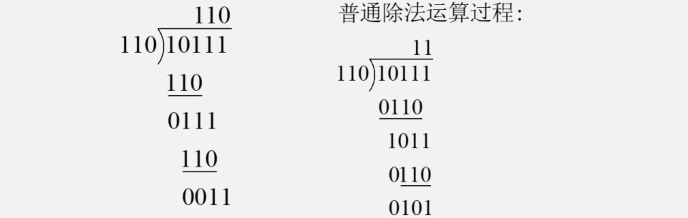

> CRC编码过程（推荐直接根据下例理解过程）：

1. 把待编码的`n`位有效信息表示为多项式`M(x)`
2. 把`M(x)`**左移`k`位**得`M(x) * x^k`，这样空出了`k`位，以便拼装`k`位余数（即校验位）
3. 选取一个`k + 1`位的**生成多项式**`G(x)`，对`M(x) * x^k`做模2除
4. 把左移`k`位后的有效信息与余数`r(x)`做模2加减，拼接得CRC码，此时共有`n + k`位

检验：把接收到的CRC码用**生成多项式**`G(x)`（发送方和接收方事先约定）的系数二进制数去除，若正确，则余数为0；若某一位出错，则余数不为0。各位出错其余数各异，余数与出错位序号之间一一对应。

特点：CRC校验**可检错**，**不可纠错**。

【例】原始报文为`10111`，其生成多项式为`G(x) = x^4 + x + 1`，对其进行CRC编码。
【解】步骤如下

1. 补充生成多项式的全部项得`G(x) = x^4 + 0 * x^3 + 0 * x^2 + x + 1`
2. 其**系数二进制数**为`10011`，长度为5，**要拼接的余数位比系数二进制数少1位**，故`r = 5 - 1 = 4`位
3. 在信息位（原始报文）后补上`r = 4`位`0`得`101110000`，再与该系数二进制数进行模2除可得余数为`1100`
4. 若余数不足`r`位则补前导零，故拼接可得CRC编码`101111100`。

### 3.3 海明校验

**海明校验**的校验码位数`r`满足`2^r >= m + r + 1`（`m`为信息位位数），插入在信息位中间（`2^k`位置）。

校验方式：分组奇偶校验（略）

特点：可检错，可纠错

---

## 4 流水线

**流水线**（Pipeline）是指在程序执行时多条指令重叠进行操作的一种准并行处理实现技术。各种部件同时处理是针对不同指令而言的，它们可同时为多条指令的不同部分进行工作，以提高各部件的利用率和指令的平均执行速度。

常用**时空图**来描述流水线的过程，如下图（左下、右下）所示：

相关参数计算：流水线执行时间计算、流水线吞吐率、流水线加速比等。

### 4.1 流水线执行时间

**流水线执行时间**：`1条指令执行时间 + (指令条数 - 1) * 流水线周期`

* **流水线周期**为执行时间最长的一段（如“执行”步骤；以下公式中用`t`表示）
* 理论公式（默认）：`(t[1] + t[2] + ... + t[k]) + (n - 1) * t`
* 实践公式（每一段都视为最长段`t`）：`k * t + (n - 1) * t`

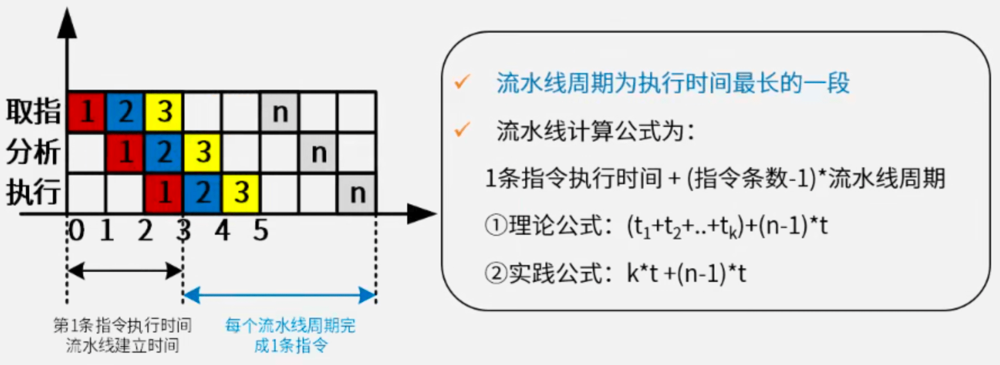

理论公式与实践公式对比：

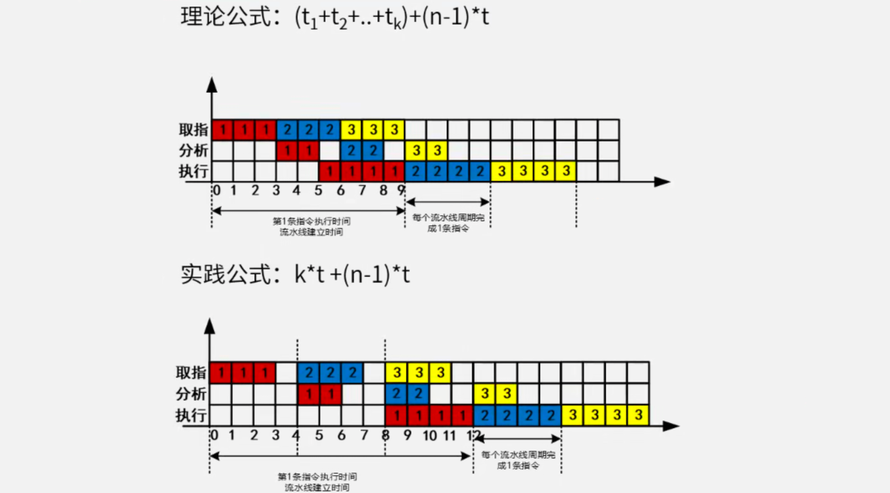

### 4.2 吞吐率

流水线的**吞吐率**（Though Put rate，TP）是指在单位时间内流水线所完成的任务数量或输出的结果数量。基本公式如下：

$$
TP=\frac{指令条数}{流水线执行时间}
$$

流水线最大吞吐率（设指令条数为$n$，每条指令有$k$步操作，流水线周期为$t$，使用实践公式）：

$$
TP_{\max} = \lim\limits_{n \rightarrow \infty} \frac{n}{(k + n - 1)t}=\frac1t
$$

### 4.3 加速比

流水线的**加速比**（Speedup）是指完成同样一批任务，不使用流水线所用的时间与使用流水线所用的时间之比（参考[阿姆达尔解决方案](https://www.hyperplasma.top/article/5173/##43_Amdahl "阿姆达尔解决方案")）。基本公式如下：

$$
S=\frac{不使用流水线执行时间}{使用流水线执行时间}
$$

---

## 5 嵌入式系统 ⭐️

**嵌入式系统**（Embedded System）是以应用为中心、以计算机技术为基础，并将可配置与可裁剪的**软、硬件集成于一体**的专用计算机系统，需要满足应用对功能、可靠性、成本、体积和功耗等方面的严格要求。

### 5.1 嵌入式的基本概念

从计算机角度看，嵌入式系统是指嵌入各种设备及应用产品内部的计算机系统。它主要完成信号控制的功能，**体积小、结构紧凑**，可作为一个部件埋藏于所控制的装置中。

一般嵌入式系统由嵌入式处理器、相关支撑硬件、嵌入式操作系统、支撑软件以及应用软件组成。

嵌入式系统软件组成架构：

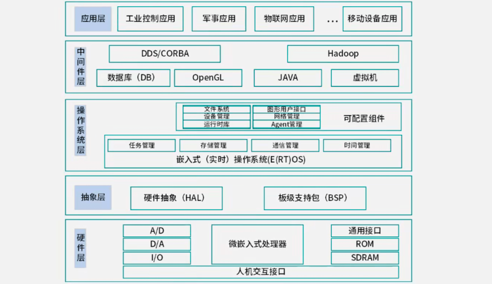

嵌入式系统初始化过程：**片级初始化 → 板级初始化 → 系统级初始化**

从传统意义上讲，嵌入式系统主要由以下部件组成：

* 嵌入式微处理器（MCU）
* 存储器：RAM、ROM
* 内（外）总线逻辑
* 定时/计数器
* **看门狗电路**：**定时器溢出则中断**，**系统复位处理**
* I/O接口：串口、网络、USB、**JTAG接口**（用来进行**CPU调试**的常用接口）
* 外部设备：UART、LED等
* 其他部件

嵌入式系统通常采用**接口中的移位寄存器**来实现数据的**串/并和并/串转换操作**。

### 5.2 嵌入式软件开发 ⭐️

> 嵌入式系统设计

#### 5.2.1 与传统软件开发的区别

嵌入式软件的开发与传统的软件开发方法存在比较大的差异，主要表现在以下方面：

* 嵌入式软件开发是在宿主机（PC机或工作站）上使用专门的嵌入式工具开发，采用**交叉编译器**生成目标机的二进制代码后，需要使用工具卸载到目标机或固化在目标机储存器上运行。
* 嵌入式软件开发时更强调软/硬件协同工作的效率和稳定性。
* 嵌入式软件开发的**结果通常需要固化在目标系统的储存器或处理器内部储存器资源中**。
* 嵌入式软件的开发**一般需要专门的开发工具、目标系统和测试设备**。
* 嵌入式软件对实时性的要求更高。
* 嵌入式软件**对安全性和可靠性的要求较高**。
* 嵌入式软件开发**要充分考虑代码规模**。
* 在安全攸关系统中的嵌入式软件，其开发还应满足某些领域对设计和代码审定。
* 模块化设计即将一个较大的程序按功能划分成若干程序模块，每个模块实现特定的功能。

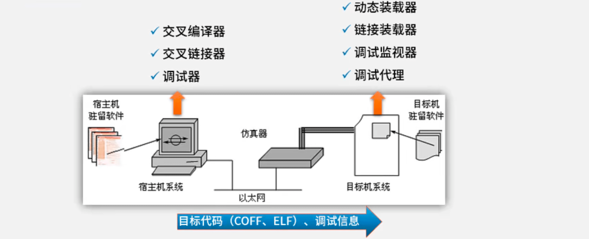

**JTAG**（Joint Test Action Group，联合测试工作组）：一种国际标准测试协议（IEEE 1149.1兼容），主要用于**芯片内部测试和调试**。

#### 5.2.2 嵌入式软件功耗控制

嵌入式软件设计层面的**功耗控制**主要可以从以下方面展开：

* **软硬件协同设计**，即软件的设计要与硬件的匹配，考虑硬件因素。
* **编译优化**，采用低功耗优化的编译技术。
* 减少系统的持续运行时间，可**从算法角度进行优化**。
* **用“中断”代替“查询”**。
  * 嵌入式系统中**采用中断方式实现输入输出**，主要原因是能对突发事件做出快速响应。在中断时，CPU断点信息一般保存到**栈**中。
* 进行电源的有效管理。

### 5.3 嵌入式硬件 ⭐️⭐️

嵌入式系统的发展大致经历了五个阶段：

1. 第一阶段：单片微型计算机（SCM）阶段，即单片机时代。
2. 第二阶段：微控制器（MCU）阶段。
3. 第三阶段：片上系统（SoC）。
4. 第四阶段：以Internet为基础的嵌入式系统。
5. 第五阶段：在智能化、云技术推动下的嵌入式系统。

#### 5.3.1 嵌入式微处理器

通常嵌入式处理器的选择还要根据使用场景不同选择不同类型的处理器，从处理器分类看，大致可分为MPU、MCU、DSP、GPU、SoC：

1. **微处理器**（Micro Processor Unit，MPU）：将微处理器装配在专门设计的电路板上，只保留与嵌入式应用有关的母板功能。微处理器一般以某一种微处理内核为核心，每一种衍生产品的处理器内核都是一样的，不同的是存储器和外设的配置和封装。
2. **微控制器**（Micro Control Unit，MCU）：又称单片机。与MPU相比，MCU的最大优点在于**单片化**，体积大大减小，从而使功耗和成本下降，可靠性提高。
3. 【**信号处理器**】（Digital Signal Processor，**DSP**）：DSP处理器对系统结构和指令进行了特殊设计（通常DSP采用一种**哈佛结构**），使其适合于执行DSP算法，编译效率高，指令执行速度也高。
4. 【**图形处理器**】（Graphics Processing Unit，**GPU**）：
   * 一种可执行染3D图形等图修的半导体芯片（处理器）。
   * 可用于个人电脑、工作站、游戏机和一些移动设备上做图像和图形相关运算工作的为处理器。
   * 可减少对CPU的依赖，并进行部分原本CPU的工作，尤其是在3D图形处理中，GPU采用的核心技术（例如：硬件T&L、纹理压缩等）保证了快速3D染能力。
   * GPU目前已广泛应用于各行各业，GPU中集成了同时运行在GHz的频率上的成千上万个core，可以高速处理图像数据。**最新的GPU峰值性能可高达100 TFlops以上**。
5. 【**片上系统**】（System on Chip，**SoC**）：
   * 追求产品系统最大包容的集成器件。
   * 是一个产品，一个**有专用目标的集成电路**，其中包含完整系统并有嵌入软件的全部内容。
   * 同时又是**一种技术**，用以实现从确定系统功能开始，到软/硬件划分，并完成设计的整个过程。
   * 成功实现了**软硬件的无缝结合**，直接在微处理器片内嵌入**操作系统的代码模块**。
   * 减小了系统的体积和功耗、提高了可靠性和设计生产效率。
   * 狭义角度：信息系统核心的芯片集成（不止是芯片），将系统关键部件集成在一块芯片上。
   * 广义角度：SoC是一个微小型系统（是整个系统，不是处理器芯片），如果说中央处理器（CPU）是大脑，那么SoC就是包括大脑、心脏、眼睛和手的系统。
   * 国内外学术界一般倾向将SoC定义为将微处理器、模拟IP核、数字IP核和存储器（或片外存储控制接口）集成在单一芯片上，它通常是客户定制的，或是面向特定用途的标准产品。

#### 5.3.2 人工智能芯片

**人工智能**（Artificial Intelligence，AI）芯片：从广义上讲只要能运行人工智能算法的芯片都称为AI芯片。但通常意义上的AI芯片指的是针对人工智能算法做了特殊加速设计的芯片，现阶段，这些人工智能算法一般以深度学习算法为主，也可包括其它机器学习算法。

AI芯片4大类（按技术架构分类）：

1. GPU
2. FPGA（现场可编程门阵列）
3. ASIC（专用集成电路）
4. 类脑芯片

AI芯片的关键特征：

* **新型的计算范式**：AI计算既不脱离传统计算，也具有**新的计算特质**
* **训练和推断**：AI系统通常涉及训练和推断过程
* **大数据处理能力**：满足高效能机器学习的数据处理要求
* 数据精度：**降低精度**的设计（模糊算法）
* **可重构的能力**：**针对特定领域而不针对特定应用的设计**，可以通过重新配置，适应新的AI算法、架构和任务
* 开发工具：AI芯片需要**软件工具链的支持**

其中，**新型的计算范式**、**训练和推断**、**大数据处理能力**、**可重构的能力**常被称为AI芯片4大关键特征。

### 5.4 嵌入式操作系统 ⭐️⭐️⭐️

**嵌入式操作系统**（Embedded Operating System，EOS）是指用于嵌入式系统的操作系统。嵌入式操作系统是一种用途广泛的系统软件，负责嵌入式系统的全部软、硬件资源分配、任务调度、控制、协调并行活动等工作。通常包括与硬件相关的底层驱动软件、系统内核、设备驱动接口、通信协议、图形界面、标准化浏览器等。

根据系统对时间的敏感程度可将嵌入式系统划分为：

* 嵌入式非实时系统
* **嵌入式实时系统**：能够在**指定或者确定的时间内**完成系统功能和外部或内部、同步或异步时间做出响应的系统。

#### 5.4.1 嵌入式实时操作系统

**嵌入式实时操作系统**（Embedded Real-Time Operating System，ERTOS）兼具嵌入式操作系统的特点和实时操作系统的特点。

特点如下所示：

1. 微型化
2. 代码质量高
3. 专业化
4. **实时性强**
5. 可裁减、可配置。

实时操作系统的最核心特点就是实时性强。在实时操作系统中，对于来自外部的事件必须在**被控对象允许的时间范围内进行处理**。

影响操作系统实时性的评价指标：

1. **中断响应**和延迟时间
2. 平均**运行**时间
3. 任务/线程**切换**时间
4. **信号量混洗时间**

嵌入式实时操作系统调度算法：

1. **优先级**调度算法：系统为每个任务分配一个**相对固定**的优先顺序。
2. **抢占式优先级**调度算法：根据任务的**紧急程度确定**该任务的优先级。**大多数RTOS调度算法都是抢占方式**（可剥夺方式）。
3. **最早截止期**调度算法（**EDF**算法）：根据任务的截止时间**头端**来确定其优先级，对于时间期限最近的任务，分配最高的优先级。
4. **最晚截止期**调度算法：根据任务的截止时间**末端**（截止期）来确定其优先级，对于时间期限最近的任务，分配最高的优先级。

#### 5.4.2 操作系统内核结构

**内核**（Kernel）是操作系统的核心部分，它管理着系统的各种资源。内核可以看成连接应用程序和硬件的一座桥梁，是直接运行在硬件上的最基础的软件实体。

从内核架构来划分，内核可以分为宏内核与微内核，其定义及特点对比如下：

1. **宏内核**（单体内核，Monolithic Kernel）：有系统API，用户空间仅有应用程序进程。
   * 特点：将图形、设备驱动及文件系统等功能全部在内核中实现，运行在内核状态和同一地址空间。
   * 优点：减少进程间通信和状态切换的系统开销，获得较高的运行效率
   * 缺点：
     * 内核庞大，占用资源较多且不易剪裁
     * 系统的稳定性和安全性不好
2. **微内核**（Micro Kernel）【**鸿蒙操作系统**】：简化了内核空间，将尽可能多的任务转移给用户空间。
   * 特点：只实现基本功能，将图形系统、文件系统、设备驱动及通信功能放在内核之外。
   * 优点：
     * **结构相当清晰**，**有利于协作开发**
     * 内核精练，便于**剪裁和移植**（**灵活性**、**可扩展性**）
     * 系统服务程序运行在用户地址空间，系统的**可靠性**、**稳定性**和**安全性**较高
     * 可用于**分布式系统**
   * 缺点：**用户态**和**核心态**需要频繁切换，从而导致系统效率不如单体内核，**性能偏低**。

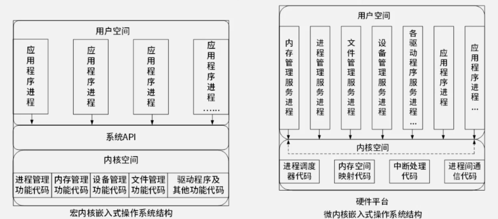

微内核的用户态与核心态如下图所示：

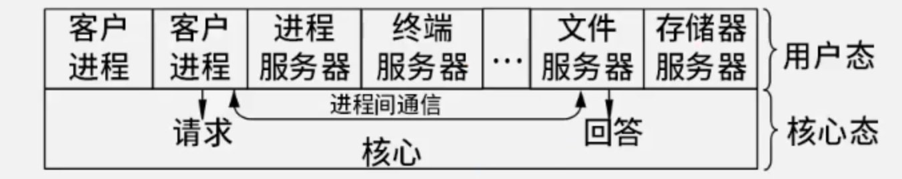

### 5.5 嵌入式数据库 ⭐️

与传统数据库相比，**嵌入式数据库系统**有以下几个主要特点：

* 嵌入式
* 实时性
* 移动性
* 伸缩性

嵌入式数据库分类：

1. **基于内存的数据库**（Main Memory Database，**MMDB**）：**实时系统**和**数据库系统**的**有机结合**。
   * 特点：是支持实时事务的最佳技术，其本质特征是**以其“主拷贝”或“工作版本”常驻内存**，即**活动事务只与实时内存数据库的内存拷贝打交道**。
2. **基于文件的数据库**（File-based Database，FDB）：以文件方式存储数据库数据，即**数据按照一定格式储存在磁盘中**。使用时由应用程序**通过相应的驱动程序甚至直接对数据文件进行读写**。
   * 特点：FDB的访问方式是被动式的，只要了解其文件格式，任何程序都可以直接读取，因此其**安全性很低**。虽然文件数据库存在诸多弊端，但是**可以满足嵌入式系统在空间、时间等方面的特殊要求**。
3. **基于网络的数据库**（Netware Database，NDB）：**基于手机4G/5G的移动通信基础之上**的数据库系统，在**逻辑上可以把嵌入式设备看作远程服务器的一个客户端**。
   * 特点：**无需解析SQL语句**；**支持更多的SQL操作**；**客户端小、无须支持可剪裁性**；**有利于代码重用**。

关于嵌入式网络数据库的补充说明：

* 实际上，嵌入式网络数据库**把功能强大的远程数据库映射到本地数据库**，**使嵌入式设备访问远程数据库就像访问本地数据库一样方便**。
* 嵌入式网络数据库主要由三部分组成：**客户端**、**通信协议**、**远程服务器**。客户端主要负责提供接口给嵌入式程序，通信协议负责规范客户端与远程服务器之间的通信，还需要解决多客户端的并发问题，远程服务器负责维护服务器上的数据库数据。
* 由**嵌入式网络数据库**、**嵌入式本地数据库**（内存或文件）和**嵌入式Web服务器**等构成了综合的**嵌入式综合信息系统**。

---

## 6 进制转换

> 不会单独考察，常与其他内容相结合

部分常用进制：

* 十进制（D）：数码`0 ~ 9`。基数`10`，位权`10^k`。
* 二进制（B）：数码`0, 1`。基数`2`，位权`2^k`。
* 十六进制（H）：数码`0 ~ 9, A ~ F`。基数`16`，位权`16^k`，
* R进制：基数`R`，位权`R^k`。

十进制与任意进制转换通法：

* R进制转十进制——**按权展开法**：`数码 × 位权`的和
  * 【例】`10100.01B = 1 × 2^4 + 1 × 2^2 + 1 × 2^(-2)`
* 十进制转R进制——**除基取余法**：短除法，余数即为**从低位到高位**上的数码
  * 【例】将94转为二进制数。如下所示，结果即为`1011110`

```
2 | 94		0
2 | 47		1
2 | 23		1
2 | 11		1
2 | 5		1
2 | 2		0
2 | 1		1
    0
```

二进制特殊方法：

* 十进制转二进制——**减法**：根据`2^n`的乘幂快速计算。待转换数减去与其最近的乘幂，最后将所减乘幂的指数排列即得。
* 二进制转八进制与十六进制：从低位起，3位（八进制）/4位一组，每组根据【**8421**】计算“1”所在位的加和，最后排列即得。
  * 【例】二进制数`10001110`的八进制为`216`，十六进制为`8E`

---

## 7 系统性能设计 ⭐️

### 7.1 性能指标

<table>
        <tr>
            <th colspan="2">分类</th>
            <th>指标</th>
        </tr>
        <tr>
            <td rowspan="4">硬件</td>
            <td>计算机</td>
			<td><strong>时钟频率（主频）</strong>；运算速度与精度；内存的存储容量；存储器的存取周期；<strong>数据处理速率（PDR）</strong>；<strong>吞吐率</strong>；各种响应时间；各种利⽤率；RASIS特性；平均故障响应时间；兼容性；可扩充性；性能价格⽐</td>
        </tr>
        <tr>
			<td>路由器</td>
			<td><strong>设备吞吐量</strong>、<strong>端⼝吞吐量</strong>、全双⼯线速转发能⼒、<strong>丢包率</strong>、<strong>时延</strong>、<strong>时延抖动</strong>、VPN⽀持能⼒、端⼝硬件队列数、基于Web的管理、⽹管类型等</td>
        </tr>
        <tr>
			<td>交换机</td>
			<td>交换机类型、配置、⽀持的⽹络类型、最⼤ATM端⼝数、<strong>⽀持协议和标准</strong>等</td>
        </tr>
        <tr>
			<td>网络</td>
			<td>设备级性能指标；⽹络级性能指标；应⽤级性能指标；⽤户级性能指标；<strong>吞吐量</strong></td>
        </tr>
		<tr>
            <td rowspan="3">软件</td>
            <td>操作系统</td>
			<td>系统的可靠性、<strong>系统的吞吐率（量）</strong>、<strong>系统响应时间</strong>、系统资源利⽤率、可移植性</td>
        </tr>
		<tr>
            <td>数据库管理系统</td>
			<td>衡量数据库管理系统的主要性能指标包括数据库本身和管理系统两部分，有：数据库的⼤⼩、数据库中表的数量、单个表的⼤⼩、表中允许的记录（⾏）数量、单个记录（⾏）的⼤⼩、表上所允许的索引数量、数据库所允许的索引数量、<strong>最⼤并发事务处理能⼒</strong>、<strong>【负载均衡能⼒】</strong>、<strong>【最⼤连接数】</strong>等</td>
        </tr>
		<tr>
            <td>WEB服务器</td>
			<td><strong>最⼤并发连接数</strong>、<strong>响应延迟</strong>、<strong>吞吐量</strong></td>
        </tr>
</table>

计算机重要性能指标：

* **字长**与**数据通路宽度**
* **主存容量**与**读取速度**
* 运算速度：计算机⼯作能⼒和⽣产效率的主要表征，取决于给定时间内CPU所能处理的数据量和CPU的主频。
  * 主频与CPU时钟周期
    * **时钟频率**（**主频**）：CPU的频率，每秒钟的脉冲数，`主频 = 外频 * 倍频`
    * **时钟周期**：脉冲完成的时间，是最小的单位时间，`时钟周期 = 1 / 主频`
  * CPI与IPC
    * **CPI**（Clock per Instruction）：平均每条指令的平均时钟周期个数，`CPI = 总周期 / 总条数`
    * **IPC**（Instruction per Clock）：每（时钟）周期运⾏指令条数，`IPC = 总条数 / 总周期`
    * `每条指令完成的总时间 = CPI * 时钟周期 = CPI / 主频`
  * **MIPS**（百万条指令/秒，Million Instructions Per Second）：每秒处理的**百万级**的机器语⾔指令数，主要⽤于衡量标量机性能，`IPS = 总条数 / 总执行时间 = 1 / 每条指令完成的总时间 = 1 / (CPI / 主频) = 主频 / CPI = 主频 * IPC`，再换算成百万级
  * **MFLOPS**（百万次浮点运算/秒，Million Floating-point Operations per Second）：每秒**百万个浮点操作**，不能反映整体情况，只能反映浮点运算情况，主要⽤于衡量向量机性能，`MFLOPS = 浮点操作次数 / (执⾏时间 * 10^6)`
* **吞吐量**与**吞吐率**
* **响应时间**（Response Time，RT）、**完成时间**（Turnaround Time，TAT）
* **兼容性**

### 7.2 性能调整

对运行系统进行评估的主要目的：**评价信息系统在性能方面的表现，找出系统可能存在的性能瓶颈**。

当系统性能下降到最基本的水平时需要考虑进行**性能调整**，由**查找**和**消除瓶颈**组成

* 对于**数据库系统**，性能调整主要包括CPU/内存使⽤状况、优化数据库设计、优化数据库管理以及进程/线程状态、硬盘剩余空间、⽇志⽂件⼤⼩等。
* 对于**应⽤系统**，性能调整主要包括应⽤系统的可⽤性、响应时间、并发⽤户数以及特定应⽤的系统资源占⽤等。

过程：

1. 准备工作：识别约束、指定负载、设定性能目标
2. 建立边界和期望
3. 分析、配置、测试、收集

### 7.3 阿姆达尔（Amdahl）解决方案

对系统中**某组件**采⽤某种更快的执⾏⽅式，所获得的系统性能的改变程度取决于**该组件被使⽤的频率**，或**所占总执⾏时间的⽐例**。**加速⽐**计算公式如下：

$$
R=\frac{T_p}{T_i}=\frac1{(1-F_e)+F_e/S_e}
$$

其中$T_p$表示不使⽤改进组件时完成整个任务的时间，$T_i$表示使⽤改进组件时完成整个任务的时间。加速⽐主要取决于两个因素：

（1）在原有的系统上，**能被改进的部分**在总执⾏时间中所占的⽐例称为**改进⽐例**，记为$F_e$，它总是⼩于1。

（2）通过改进的执⾏⽅式**所取得的性能提⾼**，即在原来的条件下系统的执⾏时间与使⽤改进组件后系统的执⾏时间之⽐（**提升的倍数**），记为$S_e$，它总是⼤于1。

【例1】假设某一功能的处理时间为整个系统运行时间的60%，若使该功能的处理速度提高至原来的5倍，则根据阿姆达尔定律，整个系统的处理速度可提高至原来的（?）倍。（A. 1.333；B. 1.923；C.1.5；D.1.829）
【解】代入公式即可，答案为B。

【例2】假设单个CPU的性能为1，则由`n`个这种CPU组成的多处理机系统的性能`P`为：`P = n / (1 + (n - 1) * a)`，其中`a`为表示开销的常数。例如，`a = 0.1, n = 4`时，`P`约为3，也就是说，由4个这种CPU组成的多机系统的性能约为3。该公式表明，多机系统的性能有一个上限，不管`n`如何增加，`P`都不会超过某个值。当`a = 0.1`时，这个上限是（?）。（A. 5；B. 10；C. 15；D. 20）
【解】求`n`趋于无穷时`P`的极限，可得`P → n / (0.1 * n) = 10 (n → ∞)`。或代入特殊值来观察答案。答案为B。

### 7.4 性能评估方法

常见的性能评价方法发展过程（着重关注基准程序法）：

1. **时钟频率法**：以时钟频率⾼低衡量速度
2. **指令执⾏速度法**：表示机器运算速度的单位为MIPS（不考虑浮点运算）
3. **等效指令速度法**（吉普森混合法，Gibson Mix）：通过各类指令在程序中所占的⽐例进⾏计算得到
   * 特点：**综合考虑指令⽐例不同的问题**
4. **数据处理速率法**（Processing Data Rate，**PDR**）：衡量机器性能，PDR值越⼤，机器性能越好，`PDR = L / R`
   * 特点：从PDR开始，**考虑CPU+存储**（此前3种均只考虑CPU）
5. **综合理论性能法**（Composite Theoretical Performance，**CTP**）：⽤**MTOPS**（Million Theoretical Operations Per Second，每秒百万次理论运算）表示。估算思想：⾸先计算处理部件每个计算单元的有效计算率，再按不同字⻓加以调整，得出该计算单元的理论性能，所有组成该处理部件的计算单元的理论性能之和即为CTP
6. 【**基准程序法**】：把应⽤程序中**⽤得最多、最频繁**的那部分**核⼼程序**作为评估计算机系统性能的标准程序，称为**基准测试程序（Benchmark）**。运行该标准程序对多种计算机系统进行检查，以比较和评价它们的性能。
   * 特点：**综合考虑多部分**，是**⽬前⼀致承认的测试系统性能的较好⽅法**

【测试精确度排名】：**真实的程序 > 核⼼程序 > ⼩型基准程序 > 合成基准程序**

基准程序分类：

* Dhrystone基准程序：它是一个综合性的整数基准测试程序，是为了测试编译器和CPU处理整数指令和控制功能的有效性，人为地选择一些典型指令综合起来形成的测试程序。
* Linpack基准程序：它是国际上最流行的用于测试高性能计算机系统浮点性能的测试。
* Whetstone基准程序：它是用Fortran语言编写的综合性测试程序，主要由执行浮点运算、功能调用、数组变址、条件转移和超越函数的程序组成。
* SPEC基准程序：一种是测试计算机完成单项任务有多快，称为速度测试；另一种是测试计算机在一定时间内能完成多少项任务，称为吞吐率测试。
* **TPC基准程序**：**TPC**（Transaction Processing Council，事务处理委员会）基准程序用以评测计算机在事务处理、数据库处理、企业管理与决策支持系统等方面的性能。该基准程序的评测结果用每秒完成的事务处理数TPC来表示。
  * TPC-A基准程序规范用于评价在OLTP环境下的数据库和硬件的性能；
  * TPC-B测试的是不包括网络的纯事务处理量，用于模拟企业计算环境；
  * TPC-C测试的是联机订货系统；
  * TPC-D、TPC-H和TPC-R测试的都是决策支持系统，其中TPC-R允许有附加的优化选项；
  * TPC-E测试的是大型企业信息服务系统。
  * TPC-W是基于Web应用的基准程序，用来测试一些通过Internet进行市场服务和销售的商业行为，所以TPC-W可以看作是一个服务器的测试标准。

### 7.5 Web服务器性能评估和系统监视

**Web服务器**的性能评估：

* Web服务器的性能指标：**最⼤并发连接数**、**响应延迟**、**吞吐量**。（丢包率属于网络指标）
* 常⻅的Web服务器性能评测⽅法：**基准性能测试**、**压⼒测试**、**可靠性测试**。

**系统监视**：进⾏系统监视通常有3种⽅式——

1. **通过系统本身提供的命令**。如UNIX/Linux系统中的`W`、`ps`、`last`，Windows中的`netstat`等。
2. 通过**系统记录⽂件**查阅系统在特定时间内的运⾏状态。
3. 集成命令、⽂件记录和可视化技术的**监控⼯具**，如**Windows的Perfmon应⽤程序**。
